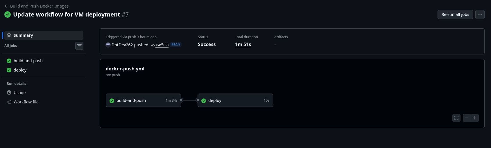
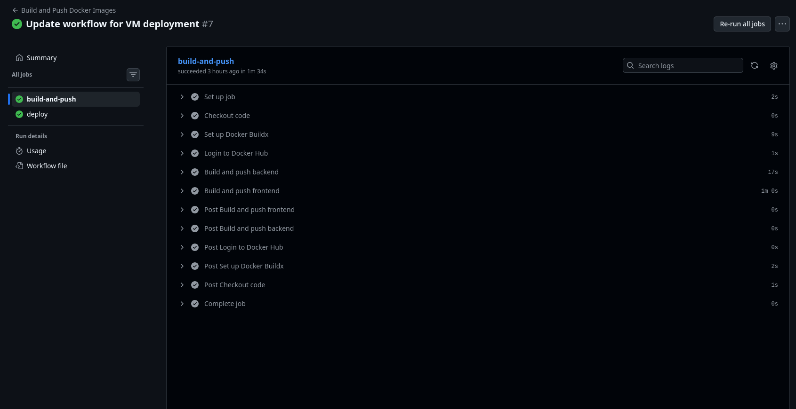
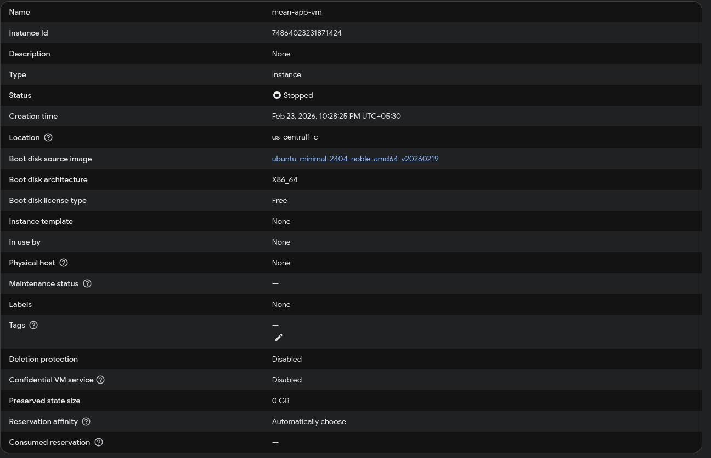
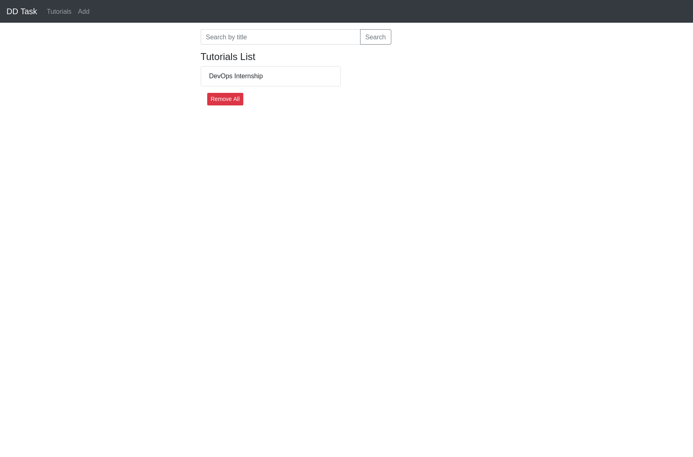

# MEAN Stack CRUD Application - Deployment Guide

A full-stack CRUD application using the MEAN stack (MongoDB, Express, Angular 15, and Node.js) with automated CI/CD deployment to Google Cloud Platform using GitHub Actions and Docker.

## Architecture Overview

```
┌─────────────────────────────────────────────────────────────────┐
│                        GitHub Repository                        │
│                    (Source Code + CI/CD)                        │
└──────────────────────────┬──────────────────────────────────────┘
                           │
                           │ Push to main branch
                           ▼
┌─────────────────────────────────────────────────────────────────┐
│                    GitHub Actions (CI/CD)                      │
│  - Build Docker images (backend + frontend)                    │
│  - Push images to Docker Hub                                   │
│  - Deploy to GCP Compute Engine VM                            │
└──────────────────────────┬──────────────────────────────────────┘
                           │
                           │ Docker Pull
                           ▼
┌─────────────────────────────────────────────────────────────────┐
│              GCP Compute Engine (Ubuntu VM)                    │
│                                                                 │
│  ┌──────────────┐  ┌──────────────┐  ┌──────────────┐        │
│  │   Frontend   │  │   Backend    │  │   MongoDB    │        │
│  │  (Angular)   │◄─┤  (Node.js)   │◄─┤   (DB)       │        │
│  │  Nginx:80    │  │   Port:8080  │  │  Port:27017  │        │
│  └──────────────┘  └──────────────┘  └──────────────┘        │
│                                                                 │
└─────────────────────────────────────────────────────────────────┘
```

## Project Structure

```
mean-app/
├── backend/                  # Node.js + Express API
│   ├── Dockerfile           # Multi-stage Docker build
│   ├── server.js            # Express server entry point
│   └── ...
├── frontend/                # Angular 15 SPA
│   ├── Dockerfile          # Angular build + Nginx container
│   ├── nginx.conf          # Nginx reverse proxy config
│   └── ...
├── docker-compose.yml      # Local development orchestration
├── .github/
│   └── workflows/
│       └── docker-push.yml # CI/CD pipeline
└── README.md
```

## Prerequisites

- **Local Development:**
  - Node.js 20+
  - Angular CLI 15
  - MongoDB (local or Atlas)
  - Docker & Docker Compose

- **Deployment:**
  - Google Cloud Platform Account
  - Docker Hub Account
  - GitHub Repository

---

## Docker Configuration

### Backend Dockerfile

```dockerfile
FROM node:20-alpine AS builder

WORKDIR /app
COPY package*.json ./
RUN npm install
COPY . .

FROM node:20-alpine AS production

WORKDIR /app
COPY --from=builder /app/node_modules ./node_modules
COPY --from=builder /app .

EXPOSE 8080

CMD ["node", "server.js"]
```

**Key Points:**
- Multi-stage build for optimized image size
- Alpine Linux for minimal footprint (~170MB)
- Production dependencies only (no dev tools)

### Frontend Dockerfile

```dockerfile
FROM node:20-alpine AS build

WORKDIR /app
COPY package*.json ./
RUN npm install
COPY . .
RUN npm run build -- --configuration=production

FROM nginx:alpine

COPY --from=build /app/dist/angular-15-crud /usr/share/nginx/html
COPY nginx.conf /etc/nginx/conf.d/default.conf

EXPOSE 80

CMD ["nginx", "-g", "daemon off;"]
```

**Key Points:**
- Builds Angular app in Node container
- Serves static files with Nginx (~25MB)
- Proxy API requests to backend

### Nginx Configuration

```nginx
server {
    listen 80;
    server_name localhost;

    location / {
        root /usr/share/nginx/html;
        index index.html index.htm;
        try_files $uri $uri/ /index.html;
    }

    location /api/ {
        proxy_pass http://backend:8080/api/;
        proxy_http_version 1.1;
        proxy_set_header Upgrade $http_upgrade;
        proxy_set_header Connection 'upgrade';
        proxy_set_header Host $host;
        proxy_cache_bypass $http_upgrade;
        proxy_set_header X-Real-IP $remote_addr;
        proxy_set_header X-Forwarded-For $proxy_add_x_forwarded_for;
        proxy_set_header X-Forwarded-Proto $scheme;
    }
}
```

**Features:**
- Serves Angular static files
- Reverse proxy for API calls to backend
- WebSocket support for real-time features

---

## CI/CD Pipeline

### Workflow: `.github/workflows/docker-push.yml`

```yaml
name: Build and Push Docker Images

on:
  push:
    branches: [ main ]
  workflow_dispatch:

jobs:
  build-and-push:
    runs-on: ubuntu-latest
    
    steps:
      - name: Checkout code
        uses: actions/checkout@v4
      
      - name: Set up Docker Buildx
        uses: docker/setup-buildx-action@v3
      
      - name: Login to Docker Hub
        uses: docker/login-action@v3
        with:
          username: ${{ secrets.DOCKERHUB_USERNAME }}
          password: ${{ secrets.DOCKERHUB_PASSWORD }}
      
      - name: Build and push backend
        uses: docker/build-push-action@v5
        with:
          context: ./backend
          push: true
          tags: dotdev262/mean-backend:latest,dotdev262/mean-backend:v1
      
      - name: Build and push frontend
        uses: docker/build-push-action@v5
        with:
          context: ./frontend
          push: true
          tags: dotdev262/mean-frontend:latest,dotdev262/mean-frontend:v1

  deploy:
    runs-on: ubuntu-latest
    needs: build-and-push
    
    steps:
      - name: Checkout code
        uses: actions/checkout@v4

      - name: Set up SSH agent
        uses: webfactory/ssh-agent@v0.8.0
        with:
          ssh-private-key: ${{ secrets.SSH_PRIVATE_KEY }}

      - name: Deploy to VM
        run: |
          ssh -o StrictHostKeyChecking=no ${{ secrets.SSH_USERNAME_ON_VM }}@${{ secrets.VM_HOST }} \
            "cd /home/${{ secrets.SSH_USERNAME_ON_VM }} && docker compose pull && docker compose up -d"
```

### CI/CD Flow Diagram

```
┌─────────────┐     ┌──────────────┐     ┌─────────────────┐
│   Commit    │────►│  GitHub      │────►│  Build & Push  │
│   to main   │     │  Actions     │     │  Docker Images │
└─────────────┘     └──────────────┘     └─────────────────┘
                                                      │
                                                      ▼
                    ┌──────────────┐     ┌─────────────────┐
                    │   Deploy to   │◄────│  Pull Images   │
                    │   GCP VM      │     │  on VM          │
                    └──────────────┘     └─────────────────┘
```

---

## GitHub Secrets Configuration

Configure these secrets in **GitHub → Settings → Secrets and variables → Actions**:

| Secret Name | Description | Example |
|-------------|-------------|---------|
| `DOCKERHUB_USERNAME` | Docker Hub username | `dotdev262` |
| `DOCKERHUB_PASSWORD` | Docker Hub password | `********` |
| `SSH_PRIVATE_KEY` | Private SSH key for VM access | `-----BEGIN OPENSSH...` |
| `SSH_USERNAME_ON_VM` | VM SSH username | `dotdev262` |
| `VM_HOST` | VM external IP address | `34.x.x.x` |

---

## Local Development Setup

### Option 1: Without Docker

```bash
# Backend
cd backend
npm install
# Update MongoDB URI in app/config/db.config.js if needed
node server.js

# Frontend (new terminal)
cd frontend
npm install
ng serve --port 8081
```

Access the application at: `http://localhost:8081`

### Option 2: With Docker Compose

```bash
# Build and run all services
docker compose up --build

# Or run in background
docker compose up -d --build
```

Access the application at: `http://localhost`

---

## GCP Deployment Setup

### Step 1: Create GCP Project & Enable Compute Engine

1. Go to [Google Cloud Console](https://console.cloud.google.com)
2. Create a new project
3. Enable Compute Engine API

### Step 2: Create VM Instance

1. **Compute Engine → VM Instances → Create Instance**
2. Configure:
   - **Name:** `mean-app-vm`
   - **Region:** Choose your region
   - **Machine Type:** `e2-medium` (or smaller)
   - **Boot Disk:** Ubuntu 22.04 LTS
   - **Firewall:** Allow HTTP, HTTPS

### Step 3: Reserve Static IP

1. **VPC Network → IP Addresses → Reserve Static Address**
2. Name: `mean-app-static-ip`
3. Attach to your VM

### Step 4: Configure Firewall Rules (GUI)

1. Go to **GCP Console → VPC Network → Firewall Rules**
2. Click **Create Firewall Rule**
3. Configure:
   - **Name:** `allow-ssh-vm`
   - **Direction:** Ingress
   - **Targets:** Specified target tags
   - **Target tags:** `http-server`, `https-server`
   - **Source IP ranges:** `0.0.0.0/0`
   - **Protocols and ports:** `tcp:22`
4. Click **Create**

### Step 4 (Alternative): Configure Firewall Rules (CLI)

### Step 5: Setup SSH Access

1. **Generate SSH key pair:**
   ```bash
   ssh-keygen -t ed25519 -f ~/.ssh/github_actions_vm_key
   ```

2. **Add public key to GCP Metadata:**
   - Go to **Compute Engine → Metadata → SSH Keys**
   - Add your public key (`~/.ssh/github_actions_vm_key.pub`)

3. **Test SSH connection:**
   ```bash
   ssh -i ~/.ssh/github_actions_vm_key <username>@<vm-ip>
   ```

### Step 6: Install Docker on VM

```bash
sudo apt update
sudo apt install -y docker.io docker-compose
sudo usermod -aG docker $USER
# Log out and back in
```

### Step 7: Create docker-compose.yml on VM

SSH into VM and create `/home/<username>/docker-compose.yml`:

```yaml
services:
  backend:
    image: dotdev262/mean-backend:latest
    environment:
      - MONGO_URI=mongodb://mongo:27017/meanapp
    ports:
      - "3000:3000"
    depends_on:
      - mongo
    restart: unless-stopped

  frontend:
    image: dotdev262/mean-frontend:latest
    ports:
      - "80:80"
    depends_on:
      - backend
    restart: unless-stopped

  mongo:
    image: mongo:8.2
    ports:
      - "27017:27017"
    volumes:
      - mongo-data:/data/db
    restart: unless-stopped

volumes:
  mongo-data:
```

### Step 8: Deploy

```bash
# Pull and start containers
docker compose pull
docker compose up -d
```

### Step 9: Access Application

- **Frontend:** `http://<your-static-ip>` (port 80)
- **Backend API:** `http://<your-static-ip>:3000`

---

## GitHub Actions Execution Screenshots

### 1. CI/CD Pipeline Configuration



When you push to the `main` branch, the workflow automatically triggers:

```
✓ Checkout code
✓ Set up Docker Buildx
✓ Login to Docker Hub
✓ Build and push backend
✓ Build and push frontend
✓ Deploy to VM
```

### 2. Docker Image Build & Push



```
✓ Build backend image
  - Tagged: dotdev262/mean-backend:latest
  - Tagged: dotdev262/mean-backend:v1
✓ Push to Docker Hub

✓ Build frontend image
  - Tagged: dotdev262/mean-frontend:latest
  - Tagged: dotdev262/mean-frontend:v1
✓ Push to Docker Hub
```

### 3. VM Deployment

The deployment connects to your GCP VM via SSH and runs docker compose to pull and start the containers.

### 4. GCP Infrastructure



Shows the GCP Compute Engine VM and firewall configuration.

### 5. Application Working UI



The MEAN stack CRUD application running in production.

---

## Application Features

- **Create Tutorial:** Add new tutorials with title, description
- **Read Tutorials:** View all tutorials in a list
- **Update Tutorial:** Edit existing tutorial details
- **Delete Tutorial:** Remove tutorials
- **Search:** Filter tutorials by title
- **Publish Status:** Mark tutorials as published/draft

---

## Troubleshooting

### Container Logs

```bash
# View all container logs
docker compose logs

# View specific service logs
docker compose logs backend
docker compose logs frontend
docker compose logs mongo
```

### Restart Services

```bash
docker compose restart
```

### Rebuild Images

```bash
docker compose build --no-cache
docker compose up -d
```

### Check Running Containers

```bash
docker ps
```

---

## Environment Variables

| Variable | Description | Default |
|----------|-------------|---------|
| `MONGO_URI` | MongoDB connection string | `mongodb://mongo:27017/meanapp` |

---

## License

MIT License
